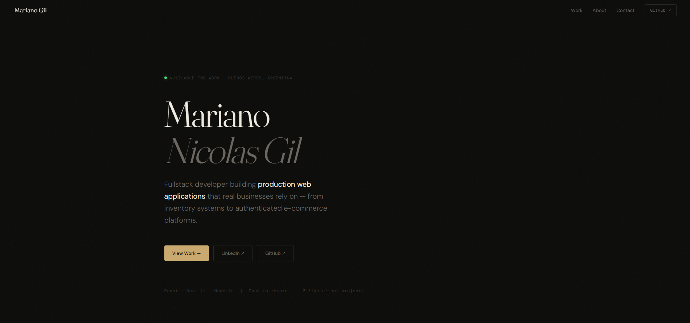

# Personal Portfolio

Modern developer portfolio built with Next.js, TypeScript and Framer Motion.

Focused on performance, responsive design and smooth UI interactions.



## Live Demo

https://tu-portfolio.vercel.app

## Features

- Responsive design
- Smooth animations with Framer Motion
- Dark mode
- Project showcase section
- Contact form
- Optimized loading performance
- SEO optimized

## Tech Stack

- Next.js
- TypeScript
- Tailwind CSS
- Framer Motion
- Shadcn/UI
- Vercel


```md
## Project Structure

src/
 ├── app/
 ├── components/
 ├── sections/
 ├── hooks/
 ├── lib/
 └── styles/

 ## Contact

- LinkedIn: https://www.linkedin.com/in/mariano-gil/
- Email: marianogil2004@gmail.com